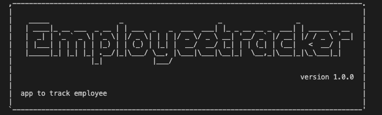

# Unit 12 MySQL Homework: Employee Tracker

Developers are often tasked with creating interfaces that make it easy for non-developers to view and interact with information stored in databases. Often these interfaces are known as **C**ontent **M**anagement **S**ystems. 

# Demo Link /Screenshot

https://drive.google.com/file/d/1KtDPjk2xlRUGGJwGD7AgRNfr5ScWP9ju/view

